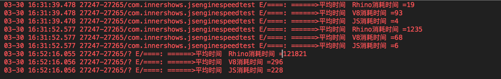

# JavaScript引擎Android端性能对比

#### 目标：
  > 选择合适的JS引擎，提升执行效率

#### JS引擎：
 - JavaScriptCore Android版
    - 优点：Apple开源，iOS默认JS引擎，safari引擎，快。已经在AppEngine iOS版验证过
    - 缺点：C语言实现，缺少Java接口。有开源维护项目[AndroidJSCore](https://github.com/ericwlange/AndroidJSCore),有性能问题未解决。如果需要使用，建议在C层做jni封装。
 - V8
    - 优点：Google开源维护引擎，Chrome使用。
    - C++ 实现。有Java实现的项目[J2V8](https://github.com/eclipsesource/J2V8)。为Android项目设计的。
 - SpiderMonkey
    - Netscape开发，由Mozilla维护。
 - Rhino
    - 优点：Mozilla开发的开源JS引擎，使用Java开发，对Java支持最好。
    - 缺点：在Dalvik少了一些特性。
 - Nashorn
    - 缺点：JDK对Rhino的替代，不支持Dalvik。


*本Demo只对 JavaScriptCore、V8 和 Rhino 做性能测试。*


#### 性能比较参数
- APK体积增量
- Java调用JavaScript代码耗时
- JavaScript调用Java代码耗时
- 内存占用


#### apk体积增量
 | JS引擎 | 体积增量
 | ----  |:---:|
 | JSCore | 42.5M
 | V8     |  7.9M(这里是包含了全平台，如果只是Android平台会小很多)
 | Rhino  | 0.6M

#### Java调用JavaScript代码耗时
- 直接执行js代码，计算时间。为了有参照价值，这里使用一个for循环，分为：
 *1万*，*100万*，*1亿* 次 做计算。

 ```javacript
    for(var i = 0 ;i<次数 ; i++){
        //pase
    }
 ```

 > 1万

 | JS引擎 | 执行时间(ms)
 | :----: |:---:|
 | JSCore | 12
 | V8     |  81.2
 | Rhino  | 86.4

 > 100万

 | JS引擎 | 执行时间(ms)
 | :----: |:---:|
 | JSCore | 22.4
 | V8     |  85.2
 | Rhino  | 7180

 > 1亿

 | JS引擎 | 执行时间(ms)
 | :----: |:---:|
 | JSCore | 237
 | V8     |  301
 | Rhino  | ~~(等待时间太久)

> 这里也提供单元测试结果，以供参考



*结论：JSCore拥有很好的性能，而Rhino在大量js运行时，耗时较长*

#### JavaScript调用Java代码耗时
 > 1万

 | JS引擎 | 执行时间(ms)
 | :----: |:---:|
 | JSCore | 366
 | V8     |  293
 | Rhino  | 193

 > 100万

 > 1亿

 | JS引擎 | 执行时间(ms)
 | :----: |:---:|
 | JSCore |  ~~(等待时间太久)
 | V8     |  ~~(等待时间太久)
 | Rhino  | ~~(等待时间太久)

> 这里也提供单元测试结果，以供参考


#### 总结
从效率来讲，Rhino因为是纯Java实现，所以JavaScript调用Java最快。当然，反过来就是最差的了。
而J2V8在两方面的效率都不算不错，但是它是通过C++实现的，所以在内存管理方面存在一些需要处理。
而JavaScriptCore太大，而且效率也有问题。


